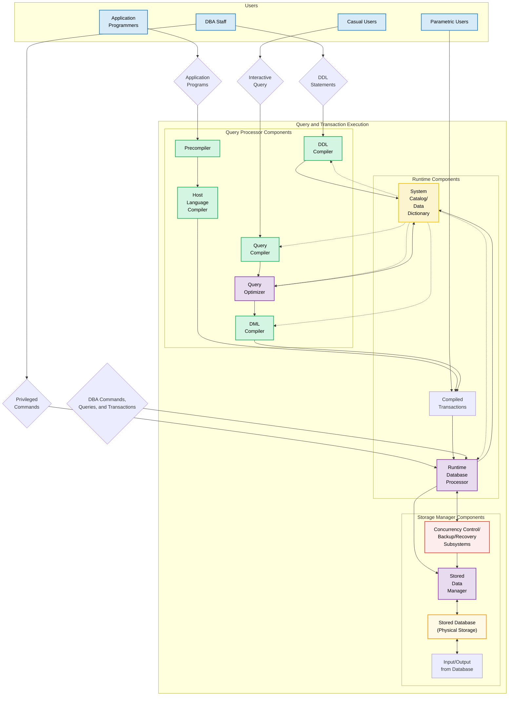
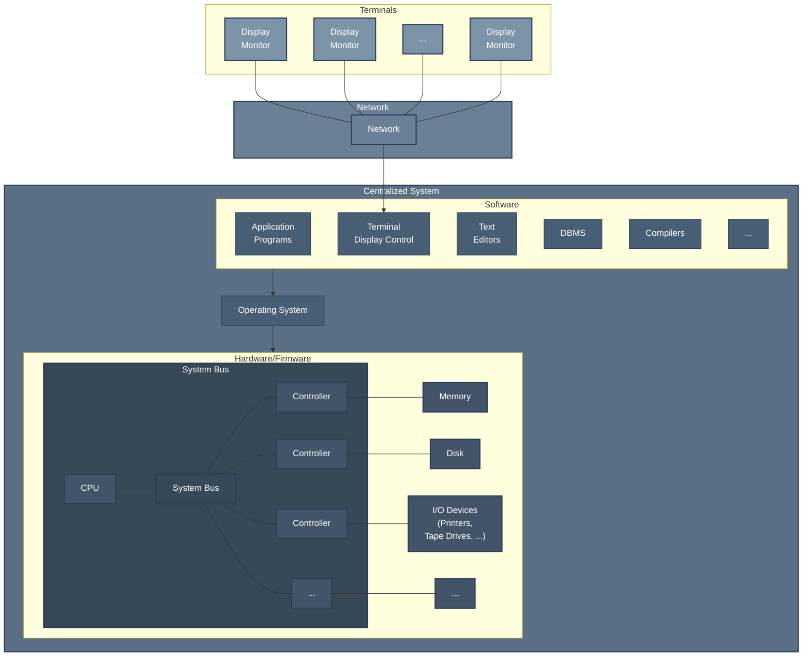
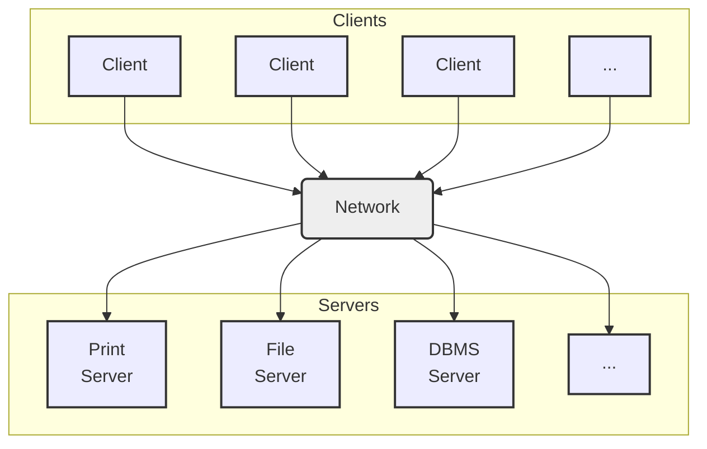
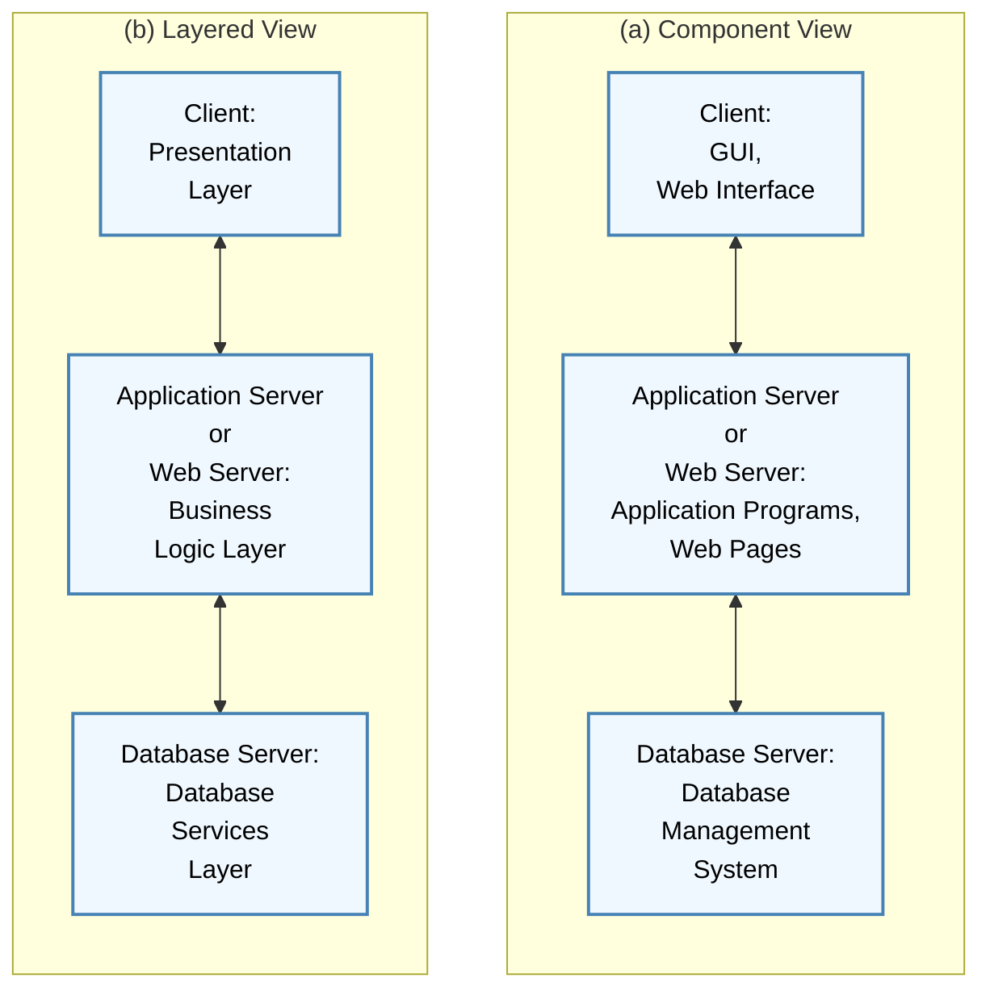

# Database System Concepts and Architecture

## Data Models

• **Data Model:**

- A set of concepts to describe the **structure** of a database, the **operations** for manipulating these structures, and certain **constraints** that the database should obey.

• **Data Model Structure and Constraints:**

- Constructs are used to define the database structure
- Constructs typically include **elements** (and their **data types**) as well as groups of elements (e.g. **entity, record, table**), and **relationships** among such groups
- Constraints specify some restrictions on valid data; these constraints must be enforced at all times

• **Data Model Operations:**

- These operations are used for specifying database **retrievals** and **updates** by referring to the constructs of the data model.
- Operations on the data model may include **basic model operations** (e.g. generic insert, delete, update) and **user-defined operations** (e.g. compute_student_gpa, update_inventory)

## Categories of Data Models

• **Conceptual (high-level, semantic) data models:**

- Provide concepts that are close to the way many users perceive data.
  - (Also called **entity-based** or **object-based** data models.)

• **Physical (low-level, internal) data models:**

- Provide concepts that describe details of how data is stored in the computer. These are usually specified in an ad-hoc manner through DBMS design and administration manuals

• **Implementation (representational) data models:**

- Provide concepts that fall between the above two, used by many commercial DBMS implementations (e.g. relational data models used in many commercial systems).

• **Self-Describing Data Models:**

- Combine the description of data with the data values. Examples include XML, key-value stores and some NOSQL systems

---

## Schemas versus Instances

• **Database Schema:**

- The **description** of a database
- Includes descriptions of the database structure, data types, and the constraints on the database.

• **Schema Diagram:**

- An **illustrative** display of (most aspects of) a database schema.

• **Schema Construct:**

- A **component** of the schema or an object within the schema, e.g., STUDENT, COURSE.

---
### Example of a Database Schema

#### STUDENT

| Name | Student_number | Class | Major |
| ---- | -------------- | ----- | ----- |

#### COURSE

| Course_name | Course_number | Credit_hours | Department |
| ----------- | ------------- | ------------ | ---------- |

#### PREREQUISITE

| Course_number | Prerequisite_number |
| ------------- | ------------------- |

#### SECTION

| Section_identifier | Course_number | Semester | Year | Instructor |
| ------------------ | ------------- | -------- | ---- | ---------- |

#### GRADE_REPORT

| Student_number | Section_identifier | Grade |
| -------------- | ------------------ | ----- |
---

• **Database State:**

- The actual data stored in a database at a **particular moment in time**. This includes the collection of all the data in the database.
- Also called **database instance** (or occurrence or snapshot).
  - The term _instance_ is also applied to individual database components, e.g. _record instance, table instance, entity instance_
---

## Database Schema vs. Database State

• **Database State:**

- Refers to the **content** of a database at a moment in time.

• **Initial Database State:**

- Refers to the database state when it is initially loaded into the system.

• **Valid State:**

- A state that satisfies the structure and constraints of the database.

• **Distinction**

- The **database schema** changes very infrequently.
- The **database state** changes every time the database is updated.

• **Schema** is also called **intension**.

• **State** is also called **extension**.

### Example of a database state

**COURSE**
| Course_name | Course_number | Credit_hours | Department |
|-------------------------|---------------|--------------|------------|
| Intro to Computer Science| CS1310 | 4 | CS |
| Data Structures | CS3320 | 4 | CS |
| Discrete Mathematics | MATH2410 | 3 | MATH |
| Database | CS3380 | 3 | CS |

**SECTION**
| Section_identifier | Course_number | Semester | Year | Instructor |
|--------------------|---------------|----------|------|------------|
| 85 | MATH2410 | Fall | 04 | King |
| 92 | CS1310 | Fall | 04 | Anderson |
| 102 | CS3320 | Spring | 05 | Knuth |
| 112 | MATH2410 | Fall | 05 | Chang |
| 119 | CS1310 | Fall | 05 | Anderson |
| 135 | CS3380 | Fall | 05 | Stone |

**GRADE_REPORT**
| Student_number | Section_identifier | Grade |
|----------------|--------------------|-------|
| 17 | 112 | B |
| 17 | 119 | C |
| 8 | 85 | A |
| 8 | 92 | A |
| 8 | 102 | B |
| 8 | 135 | A |

**PREREQUISITE**
| Course_number | Prerequisite_number |
|---------------|---------------------|
| CS3380 | CS3320 |
| CS3380 | MATH2410 |
| CS3320 | CS1310 |

---

## Three-Schema Architecture

• Proposed to support DBMS characteristics of:

- **Program-data independence.**
- Support of **multiple views** of the data.

  • Not explicitly used in commercial DBMS products, but has been useful in explaining database system organization

• Defines DBMS schemas at **three** levels:

  - **Internal schema** at the internal level to describe physical storage structures and access paths (e.g indexes).
    - Typically uses a **physical** data model.
  - **Conceptual schema** at the conceptual level to describe the structure and constraints for the whole database for a community of users.
    - Uses a **conceptual** or an **implementation** data model.
  - **External schemas** at the external level to describe the various user views.
    - Usually uses the same data model as the conceptual schema.

```mermaid
graph TD
    subgraph EndUsers["End Users"]
        U1["🧍<br/>User"]
        U2["🧍<br/>User"]
    end

    subgraph ExternalLevel["External Level"]
        direction TB
        EV1["External<br/>View"]
        Ellipsis1["..."]
        EV2["External<br/>View"]
    end

    subgraph ConceptualLevel["Conceptual Level"]
        direction TB
        CS["Conceptual Schema"]
    end

    subgraph InternalLevel["Internal Level"]
        direction TB
        IS["Internal Schema"]
    end

    subgraph StoredDB["Stored Database"]
        direction LR
        DB1["🛢️<br/>Disk"]
        DB2["🛢️<br/>Disk"]
        DB3["🛢️<br/>Disk"]
    end

    U1 --> EV1
    U2 --> EV2

    EV1 -->|External/Conceptual<br/>Mapping| CS
    Ellipsis1 --> CS
    EV2 -->|External/Conceptual<br/>Mapping| CS

    CS -->|Conceptual/Internal<br/>Mapping| IS
    IS --> StoredDB

    classDef user fill:#7c93a8,stroke:#2a3f5a,stroke-width:2px,color:#fff;
    classDef level fill:#485e75,stroke:#2a3f5a,stroke-width:1px,color:#fff;
    classDef schema fill:#5b7086,stroke:#2a3f5a,stroke-width:2px,color:#fff;
    classDef db fill:#435468,stroke:#2a3f5a,stroke-width:2px,color:#fff;

    class U1,U2 user;
    class ExternalLevel,ConceptualLevel,InternalLevel level;
    class EV1,Ellipsis1,EV2,CS,IS schema;
    class StoredDB,DB1,DB2,DB3 db;
```

• Mappings among schema levels are needed to transform requests and data.

- Programs refer to an external schema, and are mapped by the DBMS to the internal schema for execution.
- Data extracted from the internal DBMS level is reformatted to match the user's external view (e.g. formatting the results of an SQL query for display in a Web page)

---

## Data Independence

• **Logical Data Independence:**

- The capacity to change the conceptual schema without having to change the external schemas and their associated application programs.

• **Physical Data Independence:**

- The capacity to change the internal schema without having to change the conceptual schema.
- For example, the internal schema may be changed when certain file structures are reorganized or new indexes are created to improve database performance

• When a schema at a lower level is changed, only the **mappings** between this schema and higher-level schemas need to be changed in a DBMS that fully supports data independence.

• The higher-level schemas themselves are **unchanged**.

- Hence, the application programs need not be changed since they refer to the external schemas.

---

## DBMS Languages

• **Data Definition Language (DDL)**
• **Data Manipulation Language (DML)**

- **High-Level or Non-procedural Languages:** These include the relational language SQL
  - May be used in a standalone way or may be embedded in a programming language
- **Low Level or Procedural Languages:**
  - These must be embedded in a programming language

---

• **Data Definition Language (DDL):**

- Used by the DBA and database designers to specify the conceptual schema of a database.
- In many DBMSs, the DDL is also used to define internal and external schemas (views).
- In some DBMSs, separate **storage definition language (SDL)** and **view definition language (VDL)** are used to define internal and external schemas.
  - SDL is typically realized via DBMS commands provided to the DBA and database designers

---

• **Data Manipulation Language (DML):**

- Used to specify database retrievals and updates
- DML commands (data sublanguage) can be **embedded** in a general-purpose programming language (host language), such as COBOL, C, C++, or Java.
  - A library of functions can also be provided to access the DBMS from a programming language
- Alternatively, stand-alone DML commands can be applied directly (called a **query language**).

---

### Types of DML

• **High Level or Non-procedural Language:**

- For example, the SQL relational language
- Are "set"-oriented and specify what data to retrieve rather than how to retrieve it.
- Also called **declarative** languages.

• **Low Level or Procedural Language:**

- Retrieve data one record-at-a-time;
- Constructs such as looping are needed to retrieve multiple records, along with positioning pointers.

---

## DBMS Interfaces

• **Stand-alone query language interfaces**

- Example: Entering SQL queries at the DBMS interactive SQL interface (e.g. SQL\*Plus in ORACLE).
  
• **Programmer interfaces for embedding DML in programming languages.**

• **User-friendly interfaces**
  - Menu-based, forms-based, graphics-based, etc.

• **Mobile Interfaces**: interfaces allowing users to perform transactions using mobile apps

---

### DBMS Programming Language Interfaces

Programmer interfaces for embedding DML in a programming languages:

- **Embedded Approach**: e.g embedded SQL (for C, C++, etc.), SQLJ (for Java)
- **Procedure Call Approach**: e.g. JDBC for Java, ODBC (Open Database Connectivity) for other programming languages as API's (application programming interfaces)
- **Database Programming Language Approach**: e.g. ORACLE has PL/SQL, a programming language based on SQL; language incorporates SQL and its data types as integral components
- **Scripting Languages**: PHP (client-side scripting) and Python (server-side scripting) are used to write database programs.

---

### User-Friendly DBMS Interfaces

• Menu-based (Web-based), popular for browsing on the web.

• Forms-based, designed for naïve users used to filling in entries on a form.

• Graphics-based

- Point and Click, Drag and Drop, etc.
- Specifying a query on a schema diagram.

• Natural language: requests in written English.

• Combinations of the above:
- For example, both menus and forms used extensively in Web database interfaces.

---

### Other DBMS Interfaces

• Natural language: free text as a query.

• Speech : Input query and Output response.

• Web Browser with keyword search.

• Parametric interfaces, e.g., bank tellers using function keys.

• Interfaces for the DBA:
  - Creating user accounts, granting authorizations
  - Setting system parameters
  - Changing schemas or access paths

---

## Database System Utilities

• To perform certain functions such as:

- Loading data stored in files into a database. Includes data conversion tools.
- Backing up the database periodically on tape.
- Reorganizing database file structures.
- Performance monitoring utilities.
- Report generation utilities.
- Other functions, such as sorting, user monitoring, data compression, etc.

---

## Other Tools

• **Data dictionary / repository:**

- Used to store schema descriptions and other information such as design decisions, application program descriptions, user information, usage standards, etc.
  
• **Application Development Environments and CASE (computer-aided software engineering) tools:**
- PowerBuilder (Sybase), JBuilder (Borland), JDeveloper 10G (Oracle)

---

## Typical DBMS Component Modules

---

## Centralized and Client-Server DBMS Architectures

• **Centralized DBMS:**

- Combines everything into single system including- DBMS software, hardware, application programs, and user interface processing software.
- User can still connect through a remote terminal – however, all processing is done at centralized site.

---

### A Physical Centralized Architecture

## Basic 2-tier Client-Server Architectures

• **Specialized Servers with Specialized functions**

- Print server
- File server
- DBMS server
- Web server
- Email server

• Clients can access the specialized servers as needed

---

### Clients

• Provide appropriate interfaces through a client software module to access and utilize the various server resources.

• Clients may be diskless machines or PCs or Workstations with disks with only the client software installed.

• Connected to the servers via some form of a network.

- (LAN: local area network, wireless network, etc.)

---

### DBMS Server

• Provides database query and transaction services to the clients.

• Relational DBMS servers are often called SQL servers, query servers, or transaction servers.

• Applications running on clients utilize an Application Program Interface (API) to access server databases via standard interface such as:

- ODBC: Open Database Connectivity standard
- JDBC: for Java programming access

---

### Two Tier Client-Server Architecture

• Client and server must install appropriate client module and server module software for ODBC or JDBC.

• A client program may connect to several DBMSs, sometimes called the data sources.

• In general, data sources can be files or other non-DBMS software that manages data.

---

### Three Tier Client-Server Architecture

• Common for Web applications.

• Intermediate Layer called **Application Server** or **Web Server**:

- Stores the web connectivity software and the business logic part of the application used to access the corresponding data from the database server.
- Acts like a conduit for sending partially processed data between the database server and the client.
  
• Three-tier Architecture Can Enhance Security:
  - Database server only accessible via middle tier
  - Clients cannot directly access database server
  - Clients contain user interfaces and Web browsers
  - The client is typically a PC or a mobile device connected to the Web

---

## Classification of DBMSS

• **Based on the data model used**

- **Legacy**: Network, Hierarchical.
- **Currently Used**: Relational, Object-oriented, Object-relational
- **Recent Technologies**: Key-value storage systems, NOSQL systems: document based, column-based, graph-based and key-value based. Native XML DBMSs.

• **Other classifications**

- **Single-user** (typically used with personal computers) vs. **multi-user** (most DBMSs).
- **Centralized** (uses a single computer with one database) vs. **distributed** (multiple computers, multiple DBs)

---

### Variations of Distributed DBMSs (DDBMSs)

• Homogeneous DDBMS.

• Heterogeneous DDBMS.

• Federated or Multidatabase Systems.

  - Participating Databases are loosely coupled with high degree of autonomy.

• Distributed Database Systems have now come to be known as client-server based database systems because:
- They do not support a totally distributed environment, but rather a set of database servers supporting a set of clients.

---

### Cost considerations for DBMSS

• Cost Range: from free open-source systems to configurations costing millions of dollars.

• Examples of free relational DBMSs: MySQL, PostgreSQL, others.

• Commercial DBMS offer additional specialized modules, e.g. time-series module, spatial data module, document module, XML module.

- These offer additional specialized functionality when purchased separately.
- Sometimes called cartridges (e.g., in Oracle) or blades.

• Different licensing options: site license, maximum number of concurrent users (seat license), single user, etc.

---

### Other Considerations

• **Type of access paths within database system**

- E.g.- inverted indexing based (ADABAS is one such system).Fully indexed databases provide access by any keyword (used in search engines).

• **General Purpose vs. Special Purpose**
- E.g.- Airline Reservation systems or many others- reservation systems for hotel/car etc. Are special purpose OLTP (Online Transaction Processing Systems)

---

## History of Data Models (Additional Material)

• Network Model.

• Hierarchical Model.

• Relational Model.

• Object-oriented Data Models.

• Object-Relational Models.

---

### Relational Model:

- Proposed in 1970 by E.F. Codd (IBM), first commercial system in 1981-82.
- Now in several commercial products (e.g. DB2, ORACLE, MS SQL Server, SYBASE, INFORMIX).
- Several free open source implementations, e.g. MySQL, PostgreSQL
- Currently most dominant for developing database applications.
- SQL relational standards: SQL-89 (SQL1), SQL-92 (SQL2), SQL-99, SQL3, ...

---

### Object-oriented Data Models:

- Several models have been proposed for implementing in a database system.
- One set comprises models of persistent O-O Programming Languages such as C++ (e.g., in OBJECTSTORE or VERSANT), and Smalltalk (e.g., in GEMSTONE).
- Additionally, systems like O2, ORION (at MCC - then ITASCA), IRIS (at H.P.- used in Open OODB).
- Object Database Standard: ODMG-93, ODMG-version 2.0, ODMG-version 3.0.
- Chapter 12 describes this model.

---

### Object-Relational Models:

- The trend to mix object models with relational was started with Informix Universal Server.
- Relational systems incorporated concepts from object databases leading to object-relational.
- Exemplified in the versions of Oracle, DB2, and SQL Server and other DBMSs.
- Current trend by Relational DBMS vendors is to extend relational DBMSs with capability to process XML, Text and other data types.
- The term "Object-relational" is receding in the marketplace.